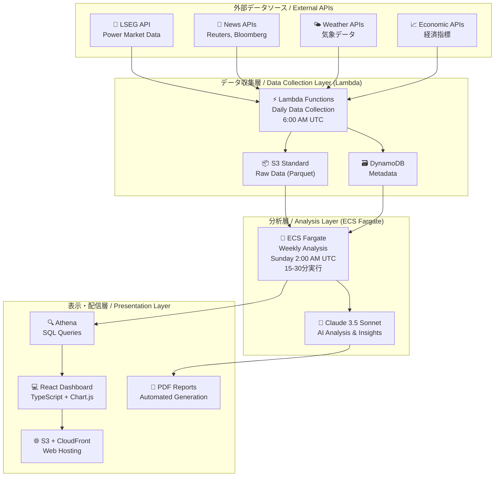

# NEXUS_ENA - エネルギー・ネクサス・アナリティクス・プラットフォーム

<div align="center">


**🚀 AWSサーバーレス・アーキテクチャ上に構築されたエンタープライズ・グレードのエネルギー市場データ分析プラットフォーム**

[](https://aws.amazon.com/)
[](https://reactjs.org/)
[](https://www.typescriptlang.org/)
[](https://www.terraform.io/)
[](https://www.python.org/)
[](https://www.anthropic.com/)

**電力市場データの次世代分析プラットフォーム**

</div>

## 🌟 概要

NEXUS_ENAは、リアルタイムデータ収集、AI駆動分析、直感的な可視化を組み合わせた次世代エネルギー市場データ分析プラットフォームです。完全にAWSサーバーレス技術上に構築され、厳格なコスト制約（月額20ドル）のもとでエンタープライズ・グレードの機能を提供します。

電力市場における原料取引データ（現物・先物）を自動収集・分析し、Claude AIを活用したニュース分析とレポート生成により、エネルギーアナリストの戦略立案を支援します。

### ✨ 主な特徴

- 📊 **リアルタイムデータ収集** - LSEG、気象API、経済指標からの自動日次収集
- 🤖 **AI駆動分析** - Claude 3.5 Sonnetを使用した週次インサイト生成
- 📈 **インタラクティブダッシュボード** - リアルタイムチャート付きReactベース可視化
- 🛡️ **エンタープライズセキュリティ** - WAF保護、暗号化、監査ログ
- 💰 **コスト最適化** - 月額6-18ドル予算内での効率的運用
- 🚀 **完全サーバーレス** - サーバー管理不要の自動スケーリング
- 🔄 **週1回の効率的分析** - リアルタイム処理を排除した低コスト・高精度分析サイクル

## 🏗️ アーキテクチャ



## 🚀 クイックスタート

### 前提条件

- 適切な権限で設定されたAWS CLI
- Terraform 1.6+
- Node.js 18+
- Python 3.9+
- Docker（ECSコンテナ用）

### 1. インフラストラクチャの展開

```bash
# リポジトリのクローン
git clone https://github.com/hozaki45/NEXUS_ENA.git
cd NEXUS_ENA

# Terraform変数の設定
cp terraform/terraform.tfvars.example terraform/terraform.tfvars
# APIキーと設定でterraform.tfvarsを編集

# インフラストラクチャの展開
cd terraform
terraform init
terraform plan
terraform apply
```

### 2. Lambda関数の展開

```bash
# データコレクターのパッケージ化と展開
cd lambda/data_collector
pip install -r requirements.txt -t .
zip -r data_collector.zip .
aws lambda update-function-code --function-name nexus-ena-data-collector-prod --zip-file fileb://data_collector.zip

# APIハンドラーのパッケージ化と展開
cd ../api_handler
pip install -r requirements.txt -t .
zip -r api_handler.zip .
aws lambda update-function-code --function-name nexus-ena-api-handler-prod --zip-file fileb://api_handler.zip
```

### 3. ECSコンテナの展開

```bash
# 分析コンテナのビルドとプッシュ
cd ecs/analysis
aws ecr get-login-password --region us-east-1 | docker login --username AWS --password-stdin <account-id>.dkr.ecr.us-east-1.amazonaws.com
docker build -t nexus-ena-analysis .
docker tag nexus-ena-analysis:latest <account-id>.dkr.ecr.us-east-1.amazonaws.com/nexus-ena-analysis:latest
docker push <account-id>.dkr.ecr.us-east-1.amazonaws.com/nexus-ena-analysis:latest
```

### 4. フロントエンドの展開

```bash
# Reactアプリケーションのビルド
cd frontend
npm install
npm run build

# S3への展開
aws s3 sync build/ s3://nexus-ena-web-prod
aws cloudfront create-invalidation --distribution-id <distribution-id> --paths "/*"
```

## 📋 設定

### 必要なAPIキー

以下をAWS Systems Manager Parameter Storeに設定してください：

- `/nexus-ena/claude-api-key` - Claude AI APIキー
- `/nexus-ena/lseg-api-key` - LSEG市場データAPIキー
- `/nexus-ena/weather-api-key` - 気象サービスAPIキー（オプション）
- `/nexus-ena/economic-api-key` - 経済データAPIキー（オプション）

### 環境変数

```bash
# Lambda環境変数
S3_BUCKET=nexus-ena-data-lake-prod
DYNAMODB_TABLE=nexus-ena-metadata-prod
ENVIRONMENT=prod

# React環境変数
REACT_APP_API_URL=https://your-api-gateway-url.amazonaws.com
```

## 💰 コスト分析

| 構成 | 月額費用 | 機能 |
|------|----------|------|
| **開発環境** | $4.50 | 基本監視、単一リージョン |
| **本番環境** | $9.00 | 強化セキュリティ、リージョン間バックアップ |
| **エンタープライズ** | $17.50 | 完全コンプライアンス、高度監視 |

### コスト内訳
- **コンピューティング（Lambda + ECS）**: $0.60/月
- **ストレージ（S3 + DynamoDB）**: $1.46/月  
- **セキュリティ（WAF + 監視）**: $2.51/月
- **ネットワーク（CloudFront + データ転送）**: $1.35/月

## 🛡️ セキュリティ

### セキュリティ機能

- **🔐 認証**: JWTトークン付きAWS Cognito
- **🛡️ Webアプリケーションファイアウォール**: カスタムルール付きAWS WAF
- **🔒 暗号化**: 保存時AES-256、転送時TLS 1.2+
- **📝 監査ログ**: すべてのAPI呼び出しに対するCloudTrail
- **🎯 アクセス制御**: 最小権限原則のIAMロール
- **🔍 監視**: CloudWatchアラームとダッシュボード

### コンプライアンス

- **SOC 2 Type II** フレームワーク準拠
- **GDPR** データ保護コンプライアンス
- **金融サービス** セキュリティ基準

## 📊 データソース

### サポートされるAPI

| ソース | データ型 | 頻度 | コスト影響 |
|--------|----------|------|------------|
| **LSEG** | 電力市場価格、需給 | 日次 | 中程度 |
| **気象API** | 気温、風力、降水量 | 日次 | 低い |
| **経済API** | 商品価格、指標 | 日次 | 低い |
| **Reuters** | ニュース感情分析 | オプション | 中程度 |
| **Bloomberg** | 高度な金融データ | オプション | 高い |

## 🤖 AI分析

### Claude AI統合

プラットフォームは以下のために **Claude 3.5 Sonnet** を活用します：

- **📈 市場トレンド分析** - 価格変動のパターン認識
- **🌡️ 気象影響評価** - エネルギー需要との相関分析
- **💹 経済要因分析** - エネルギー市場におけるマクロ経済の影響
- **📋 自動レポート生成** - インサイト付き週次PDFレポート
- **🎯 リスク評価** - ボラティリティと市場リスクの評価

### AI分析サンプル

```
🔍 週次分析サマリー：
• 極端な気象条件により電力価格が12%上昇
• 再生可能エネルギー発電が予想を18%上回る
• 全地域で天然ガスの相関関係が強化
• 不安定な期間のヘッジ戦略を推奨
```

## 📈 監視とアラート

### 主要指標

- **データ収集成功率**: 99.5%以上を目標
- **分析完了時間**: 30分以内
- **ダッシュボード読み込み時間**: 2秒以内
- **月額費用**: 20ドル未満を閾値

### アラート設定

```yaml
クリティカルアラート:
  - Lambda関数の失敗
  - ECSタスクの失敗
  - コスト閾値超過（月額18ドル以上）
  - データ破損検出

警告アラート:
  - API制限の近接
  - ストレージ容量80%達成
  - 異常なデータパターン
```

## 🔄 データパイプライン

### 処理フロー

1. **📥 日次収集**（6:00 AM UTC）
   - LambdaがAPIからデータ収集を開始
   - データ検証と変換
   - S3にParquet形式で保存
   - DynamoDBのメタデータ更新

2. **🧠 週次分析**（日曜日 2:00 AM UTC）
   - ECS Fargateタスクが蓄積データを処理
   - Claude AIがインサイトと分析を生成
   - PDFレポートの作成と保存
   - ダッシュボードデータの更新

3. **📊 リアルタイム可視化**
   - ReactダッシュボードがAPI を5分ごとにポーリング
   - 最新データでチャートを更新
   - 重要イベントのユーザー通知

## 🛠️ メンテナンス

### 定期タスク

- **日次**: コストと使用量メトリクスの監視
- **週次**: 分析レポートとインサイトのレビュー
- **月次**: セキュリティパッチ更新と依存関係レビュー
- **四半期**: アーキテクチャレビューと最適化

### バックアップと復旧

- **RTO**: 4時間（復旧時間目標）
- **RPO**: 24時間（復旧ポイント目標）
- **マルチリージョン**: us-west-2への自動フェイルオーバー
- **データ保持**: ライフサイクル管理付き7年間

## 🤝 コントリビューション

1. リポジトリをフォーク
2. 機能ブランチを作成（`git checkout -b feature/amazing-feature`）
3. 変更をコミット（`git commit -m 'Add amazing feature'`）
4. ブランチにプッシュ（`git push origin feature/amazing-feature`）
5. プルリクエストを作成

### 開発ガイドライン

- TypeScriptとPythonのコーディング標準に従う
- 新機能にテストを追加
- API変更についてドキュメントを更新
- セキュリティベストプラクティスを確保

## 📄 ライセンス

このプロジェクトはMITライセンスの下でライセンスされています - 詳細は[LICENSE](LICENSE)ファイルを参照してください。

## 🆘 サポート

- **📧 メール**: support@nexus-ena.com
- **📚 ドキュメント**: [docs.nexus-ena.com](https://docs.nexus-ena.com)
- **🐛 課題**: [GitHub Issues](https://github.com/hozaki45/NEXUS_ENA/issues)
- **💬 Discord**: [コミュニティサーバー](https://discord.gg/nexus-ena)

## 🏆 謝辞

- **AWS** - サーバーレスプラットフォーム機能
- **Anthropic** - Claude AI統合
- **エネルギー市場データプロバイダー** - 包括的なデータアクセス
- **オープンソースコミュニティ** - 基盤ライブラリとツール

---

**エネルギー業界のために❤️で構築**

*高度な分析とAI駆動インサイトにより、エネルギー市場でのデータ駆動意思決定を支援します。*