# NEXUS_ENA - Energy Nexus Analytics Platform

<div align="center">


**🚀 Enterprise-grade energy market data analysis platform built on AWS Serverless Architecture**

[](https://aws.amazon.com/)
[](https://reactjs.org/)
[](https://www.typescriptlang.org/)
[](https://www.terraform.io/)
[](https://www.python.org/)
[](https://www.anthropic.com/)

**電力市場データの次世代分析プラットフォーム**

</div>

## 🌟 Overview

NEXUS_ENA is a next-generation energy market data analysis platform that combines real-time data collection, AI-powered analysis, and intuitive visualization. Built entirely on AWS serverless technologies, it delivers enterprise-grade capabilities while operating under strict cost constraints ($20/month).

電力市場における原料取引データ（現物・先物）を自動収集・分析し、Claude AIを活用したニュース分析とレポート生成により、エネルギーアナリストの戦略立案を支援します。

### ✨ Key Features

- 📊 **Real-time Data Collection** - Automated daily collection from LSEG, weather APIs, and economic indicators
- 🤖 **AI-Powered Analysis** - Weekly insights generated using Claude 3.5 Sonnet
- 📈 **Interactive Dashboard** - React-based visualization with real-time charts
- 🛡️ **Enterprise Security** - WAF protection, encryption, and audit logging
- 💰 **Cost-Optimized** - Operates efficiently within $6-18/month budget
- 🚀 **Fully Serverless** - Auto-scaling with zero server management
- 🔄 **週1回の効率的分析** - リアルタイム処理を排除した低コスト・高精度分析サイクル

## 🏗️ Architecture

```mermaid
graph TB
    subgraph "外部データソース / External Data Sources"
        LSEG["🔌 LSEG SFTP<br/>Power Market Data Files"]
        NEWS["📰 News APIs<br/>Reuters, Bloomberg"]
        WEATHER["🌤️ Weather APIs<br/>気象データ"]
        ECONOMIC["📈 Economic APIs<br/>経済指標"]
    end

    subgraph "データ収集層 / Data Collection Layer (ECS Fargate)"
        ECS_COLLECT["🚀 ECS Fargate Task<br/>Daily SFTP Collection<br/>6:00 AM UTC<br/>VPC + SSH Auth"]
        S3_RAW["📦 S3 Standard<br/>Raw Data (Parquet)"]
        DDB["🗃️ DynamoDB<br/>Metadata"]
    end

    subgraph "分析層 / Analysis Layer (ECS Fargate)"
        ECS["🚀 ECS Fargate<br/>Weekly Analysis<br/>Sunday 2:00 AM UTC<br/>15-30分実行"]
        CLAUDE["🤖 Claude 3.5 Sonnet<br/>AI Analysis & Insights"]
    end

    subgraph "表示・配信層 / Presentation Layer"
        REACT["💻 React Dashboard<br/>TypeScript + Chart.js"]
        S3_WEB["🌐 S3 + CloudFront<br/>Web Hosting"]
        PDF["📄 PDF Reports<br/>Automated Generation"]
        ATHENA["🔍 Athena<br/>SQL Queries"]
    end

    LSEG --> ECS_COLLECT
    NEWS --> ECS_COLLECT
    WEATHER --> ECS_COLLECT
    ECONOMIC --> ECS_COLLECT
    ECS_COLLECT --> S3_RAW
    ECS_COLLECT --> DDB
    S3_RAW --> ECS
    DDB --> ECS
    ECS --> CLAUDE
    CLAUDE --> PDF
    ECS --> ATHENA
    ATHENA --> REACT
    REACT --> S3_WEB
```



## 🚀 Quick Start

### Prerequisites

- AWS CLI configured with appropriate permissions
- Terraform 1.6+
- Node.js 18+
- Python 3.9+
- Docker (for ECS containers)

### 1. Infrastructure Deployment

```bash
# Clone the repository
git clone https://github.com/hozaki45/NEXUS_ENA.git
cd NEXUS_ENA

# Configure Terraform variables
cp terraform/terraform.tfvars.example terraform/terraform.tfvars
# Edit terraform.tfvars with your API keys and preferences

# Deploy infrastructure
cd terraform
terraform init
terraform plan
terraform apply
```

### 2. Lambda Functions Deployment

```bash
# Package and deploy data collector
cd lambda/data_collector
pip install -r requirements.txt -t .
zip -r data_collector.zip .
aws lambda update-function-code --function-name nexus-ena-data-collector-prod --zip-file fileb://data_collector.zip

# Package and deploy API handler
cd ../api_handler
pip install -r requirements.txt -t .
zip -r api_handler.zip .
aws lambda update-function-code --function-name nexus-ena-api-handler-prod --zip-file fileb://api_handler.zip
```

### 3. ECS Container Deployment

```bash
# Build and push analysis container
cd ecs/analysis
aws ecr get-login-password --region us-east-1 | docker login --username AWS --password-stdin <account-id>.dkr.ecr.us-east-1.amazonaws.com
docker build -t nexus-ena-analysis .
docker tag nexus-ena-analysis:latest <account-id>.dkr.ecr.us-east-1.amazonaws.com/nexus-ena-analysis:latest
docker push <account-id>.dkr.ecr.us-east-1.amazonaws.com/nexus-ena-analysis:latest
```

### 4. Frontend Deployment

```bash
# Build React application
cd frontend
npm install
npm run build

# Deploy to S3
aws s3 sync build/ s3://nexus-ena-web-prod
aws cloudfront create-invalidation --distribution-id <distribution-id> --paths "/*"
```

## 📋 Configuration

### Required API Keys

Set these in AWS Systems Manager Parameter Store:

- `/nexus-ena/claude-api-key` - Claude AI API key
- `/nexus-ena/lseg-api-key` - LSEG market data API key
- `/nexus-ena/weather-api-key` - Weather service API key (optional)
- `/nexus-ena/economic-api-key` - Economic data API key (optional)

### Environment Variables

```bash
# Lambda Environment Variables
S3_BUCKET=nexus-ena-data-lake-prod
DYNAMODB_TABLE=nexus-ena-metadata-prod
ENVIRONMENT=prod

# React Environment Variables
REACT_APP_API_URL=https://your-api-gateway-url.amazonaws.com
```

## 💰 Cost Analysis

| Configuration | Monthly Cost | Features |
|---------------|--------------|-----------|
| **Development** | $4.50 | Basic monitoring, single region |
| **Production** | $9.00 | Enhanced security, cross-region backup |
| **Enterprise** | $17.50 | Full compliance, advanced monitoring |

### Cost Breakdown
- **Compute (Lambda + ECS)**: $0.60/month
- **Storage (S3 + DynamoDB)**: $1.46/month  
- **Security (WAF + Monitoring)**: $2.51/month
- **Networking (CloudFront + Data Transfer)**: $1.35/month

## 🛡️ Security

### Security Features

- **🔐 Authentication**: AWS Cognito with JWT tokens
- **🛡️ Web Application Firewall**: AWS WAF with custom rules
- **🔒 Encryption**: AES-256 at rest, TLS 1.2+ in transit
- **📝 Audit Logging**: CloudTrail for all API calls
- **🎯 Access Control**: IAM roles with least privilege
- **🔍 Monitoring**: CloudWatch alarms and dashboards

### Compliance

- **SOC 2 Type II** framework alignment
- **GDPR** data protection compliance
- **Financial Services** security standards

## 📊 Data Sources

### Supported APIs

| Source | Data Type | Frequency | Cost Impact |
|--------|-----------|-----------|-------------|
| **LSEG** | Power market prices, demand/supply | Daily | Medium |
| **Weather APIs** | Temperature, wind, precipitation | Daily | Low |
| **Economic APIs** | Commodity prices, indicators | Daily | Low |
| **Reuters** | News sentiment analysis | Optional | Medium |
| **Bloomberg** | Advanced financial data | Optional | High |

## 🤖 AI Analysis

### Claude AI Integration

The platform leverages **Claude 3.5 Sonnet** for:

- **📈 Market Trend Analysis** - Pattern recognition in price movements
- **🌡️ Weather Impact Assessment** - Correlation analysis with energy demand
- **💹 Economic Factor Analysis** - Macro-economic influence on energy markets
- **📋 Automated Report Generation** - Weekly PDF reports with insights
- **🎯 Risk Assessment** - Volatility and market risk evaluation

### Sample AI Insights

```
🔍 Weekly Analysis Summary:
• Power prices increased 12% due to extreme weather conditions
• Renewable generation exceeded forecasts by 18%
• Natural gas correlation strengthened across all regions
• Recommended hedging strategies for volatile periods
```

## 📈 Monitoring & Alerts

### Key Metrics

- **Data Collection Success Rate**: >99.5% target
- **Analysis Completion Time**: <30 minutes
- **Dashboard Load Time**: <2 seconds
- **Monthly Cost**: <$20 threshold

### Alert Configuration

```yaml
Critical Alerts:
  - Lambda function failures
  - ECS task failures  
  - Cost threshold exceeded (>$18/month)
  - Data corruption detected

Warning Alerts:
  - API rate limits approaching
  - Storage quota at 80%
  - Unusual data patterns
```

## 🔄 Data Pipeline

### Processing Flow

1. **📥 Daily Collection** (6:00 AM UTC)
   - Lambda triggers data collection from APIs
   - Data validation and transformation
   - Storage in S3 (Parquet format)
   - Metadata updates in DynamoDB

2. **🧠 Weekly Analysis** (Sunday 2:00 AM UTC)
   - ECS Fargate task processes accumulated data
   - Claude AI generates insights and analysis
   - PDF reports created and stored
   - Dashboard data updated

3. **📊 Real-time Visualization**
   - React dashboard polls API every 5 minutes
   - Charts update with latest data
   - User notifications for important events

## 🛠️ Maintenance

### Regular Tasks

- **Daily**: Monitor cost and usage metrics
- **Weekly**: Review analysis reports and insights
- **Monthly**: Security patch updates and dependency reviews
- **Quarterly**: Architecture review and optimization

### Backup & Recovery

- **RTO**: 4 hours (Recovery Time Objective)
- **RPO**: 24 hours (Recovery Point Objective)
- **Multi-region**: Automatic failover to us-west-2
- **Data Retention**: 7 years with lifecycle management

## 🤝 Contributing

1. Fork the repository
2. Create a feature branch (`git checkout -b feature/amazing-feature`)
3. Commit changes (`git commit -m 'Add amazing feature'`)
4. Push to branch (`git push origin feature/amazing-feature`)
5. Open a Pull Request

### Development Guidelines

- Follow TypeScript and Python coding standards
- Add tests for new functionality
- Update documentation for API changes
- Ensure security best practices

## 📄 License

This project is licensed under the MIT License - see the [LICENSE](LICENSE) file for details.

## 🆘 Support

- **📧 Email**: support@nexus-ena.com
- **📚 Documentation**: [docs.nexus-ena.com](https://docs.nexus-ena.com)
- **🐛 Issues**: [GitHub Issues](https://github.com/hozaki45/NEXUS_ENA/issues)
- **💬 Discord**: [Community Server](https://discord.gg/nexus-ena)

## 🏆 Acknowledgments

- **AWS** for serverless platform capabilities
- **Anthropic** for Claude AI integration
- **Energy Market Data Providers** for comprehensive data access
- **Open Source Community** for foundational libraries and tools

---

**Built with ❤️ for the Energy Industry**

*Empowering data-driven decisions in energy markets through advanced analytics and AI-powered insights.*