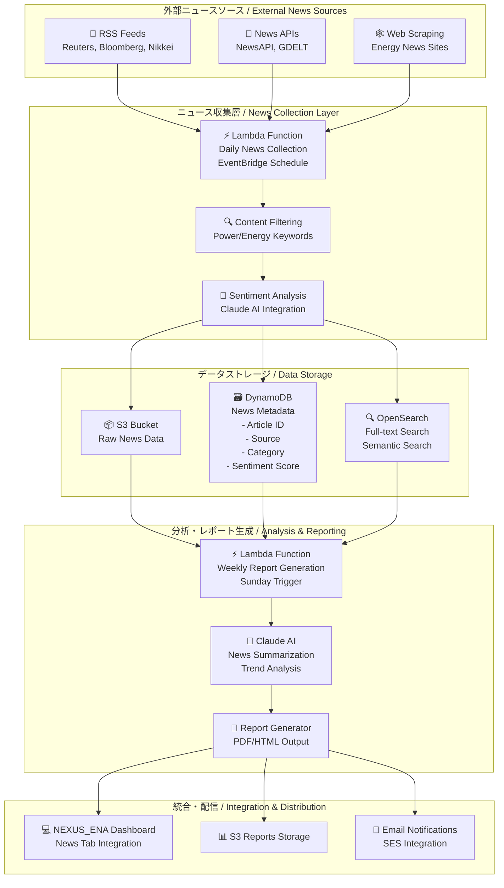

# 電力・原材料ニュース収集システム設計書

## 概要

NEXUS_ENAプラットフォームに統合される電力・原材料関連ニュース収集・分析システムの設計文書です。定期的なニュース収集、データベース保存、Claude AIによる週次レポート生成を実現します。

## システム全体アーキテクチャ



## データベース設計

### DynamoDB テーブル設計

```json
{
  "TableName": "nexus-ena-news-articles",
  "KeySchema": [
    {
      "AttributeName": "article_id",
      "KeyType": "HASH"
    },
    {
      "AttributeName": "published_date",
      "KeyType": "RANGE"
    }
  ],
  "AttributeDefinitions": [
    {
      "AttributeName": "article_id",
      "AttributeType": "S"
    },
    {
      "AttributeName": "published_date",
      "AttributeType": "S"
    },
    {
      "AttributeName": "source",
      "AttributeType": "S"
    },
    {
      "AttributeName": "category",
      "AttributeType": "S"
    }
  ],
  "GlobalSecondaryIndexes": [
    {
      "IndexName": "source-date-index",
      "KeySchema": [
        {
          "AttributeName": "source",
          "KeyType": "HASH"
        },
        {
          "AttributeName": "published_date",
          "KeyType": "RANGE"
        }
      ]
    },
    {
      "IndexName": "category-date-index",
      "KeySchema": [
        {
          "AttributeName": "category",
          "KeyType": "HASH"
        },
        {
          "AttributeName": "published_date",
          "KeyType": "RANGE"
        }
      ]
    }
  ]
}
```

### データ構造

```json
{
  "article_id": "reuters_20250105_energy_001",
  "published_date": "2025-01-05T10:30:00Z",
  "title": "原油価格急騰、電力コストに影響",
  "content": "記事本文...",
  "source": "reuters",
  "category": "energy_market",
  "subcategory": "crude_oil",
  "language": "ja",
  "sentiment_score": 0.7,
  "sentiment_label": "positive",
  "keywords": ["原油", "電力", "エネルギー市場"],
  "entities": [
    {
      "name": "WTI原油",
      "type": "commodity",
      "confidence": 0.95
    }
  ],
  "url": "https://reuters.com/...",
  "image_url": "https://cdn.reuters.com/...",
  "created_at": "2025-01-05T10:35:00Z",
  "processed_at": "2025-01-05T10:40:00Z",
  "summary": "Claude AIによる要約...",
  "market_impact": "high",
  "relevance_score": 0.9
}
```

## 定期実行スケジュール

### EventBridge スケジュール設定

```yaml
# 日次ニュース収集スケジュール
daily_news_collection:
  schedule_expression: "rate(6 hours)"  # 4回/日
  targets:
    - lambda_function: "nexus-ena-news-collector"
      input:
        collection_type: "routine"
        sources: ["reuters", "bloomberg", "nikkei"]

# 週次レポート生成スケジュール  
weekly_report_generation:
  schedule_expression: "cron(0 2 ? * SUN *)"  # 毎週日曜日 2:00 AM UTC
  targets:
    - lambda_function: "nexus-ena-weekly-reporter"
      input:
        report_type: "comprehensive"
        period: "last_7_days"

# 緊急ニュース収集（高頻度）
urgent_news_collection:
  schedule_expression: "rate(1 hour)"  # 1回/時間
  targets:
    - lambda_function: "nexus-ena-news-collector"
      input:
        collection_type: "urgent"
        keywords: ["電力停止", "原油価格急騰", "エネルギー危機"]
```

### コスト最適化スケジュール

```yaml
# 営業時間内（高頻度）
business_hours:
  schedule: "cron(0 9-17/2 ? * MON-FRI *)"  # 平日9-17時、2時間毎
  cost_per_day: "$0.50"

# 営業時間外（低頻度）
off_hours:
  schedule: "cron(0 6,22 ? * MON-FRI *)"  # 平日朝夕のみ
  cost_per_day: "$0.10"

# 週末（最小頻度）
weekend:
  schedule: "cron(0 10 ? * SAT,SUN *)"  # 週末1回のみ
  cost_per_day: "$0.05"
```

## 週次レポート生成システム

### Claude AI 統合レポート生成

```python
# 週次レポート生成のワークフロー
class WeeklyNewsReportGenerator:
    def __init__(self):
        self.claude_client = anthropic.Client()
        self.dynamodb = boto3.resource('dynamodb')
        self.s3 = boto3.client('s3')
        
    def generate_weekly_report(self, start_date, end_date):
        """週次レポート生成メインロジック"""
        # 1. データ収集
        news_articles = self.collect_weekly_news(start_date, end_date)
        
        # 2. カテゴリ別分析
        analysis_results = self.analyze_news_by_category(news_articles)
        
        # 3. Claude AIでレポート生成
        report_content = self.generate_ai_report(analysis_results)
        
        # 4. PDF/HTML生成
        formatted_report = self.format_report(report_content)
        
        # 5. S3保存 & 通知
        self.save_and_notify(formatted_report)
        
        return formatted_report
```

### レポート構成テンプレート

```markdown
# 週次エネルギー市場ニュース分析レポート
## 対象期間: {start_date} - {end_date}

### 📈 今週のハイライト
- **最重要ニュース**: Claude AIが選定した影響度の高いニュース
- **市場動向**: 価格変動と関連ニュースの相関分析
- **注目トピック**: 頻出キーワードと関連性分析

### 🔍 カテゴリ別分析

#### ⚡ 電力市場
- **記事数**: {power_articles_count}
- **主要トピック**: {power_main_topics}
- **センチメント**: {power_sentiment_summary}
- **影響度評価**: {power_impact_assessment}

#### 🛢️ 原油・エネルギー
- **記事数**: {energy_articles_count}
- **価格動向**: {energy_price_trends}
- **地政学的影響**: {geopolitical_impact}

#### 🏭 原材料・コモディティ
- **記事数**: {commodity_articles_count}
- **供給状況**: {supply_situation}
- **需要予測**: {demand_forecast}

### 📊 統計サマリー
- **収集記事総数**: {total_articles}
- **情報源別内訳**: {source_breakdown}
- **言語別内訳**: {language_breakdown}
- **センチメント分布**: {sentiment_distribution}

### 🎯 来週の注目ポイント
- **予想される重要イベント**: {upcoming_events}
- **継続監視トピック**: {monitoring_topics}
- **リスク要因**: {risk_factors}

### 🔗 関連リンク
- **重要記事リンク**: {important_articles_links}
- **データダッシュボード**: {dashboard_link}
```

### AI分析プロンプト設計

```python
WEEKLY_ANALYSIS_PROMPT = """
以下の電力・エネルギー関連ニュースを分析し、週次レポートを作成してください：

【分析対象データ】
期間: {date_range}
記事数: {article_count}
主要カテゴリ: {categories}

【記事データ】
{news_articles_json}

【分析要件】
1. 今週の最重要ニュース3つを選定し、その理由を説明
2. カテゴリ別のトレンド分析（電力、原油、原材料）
3. 市場への影響度評価（高・中・低）
4. センチメント分析とその変化
5. 来週の注目ポイント予測

【出力形式】
- 日本語で作成
- 簡潔かつ専門的な分析
- 定量的データを含む
- アクションアイテムを提示

【制約事項】
- 文字数: 2000-3000字
- 客観的な分析を重視
- 根拠となるデータを明記
"""
```

## コスト見積もり・最適化

### 月額運用コスト予算

| コンポーネント | 月額コスト | 詳細 |
|---------------|------------|------|
| **Lambda実行** | $2.50 | 日次収集4回×30日 + 週次レポート4回 |
| **DynamoDB** | $1.80 | 1000記事/月、読み取り重視 |
| **S3ストレージ** | $0.70 | 記事データ + PDFレポート |
| **Claude AI API** | $4.00 | 週次分析 + センチメント分析 |
| **OpenSearch** | $0.80 | 小規模インスタンス |
| **EventBridge** | $0.20 | スケジュール実行 |
| **SES (Email)** | $0.10 | 週次レポート配信 |
| **データ転送** | $0.30 | API呼び出し・画像取得 |
| **合計** | **$10.40** | **既存NEXUS_ENA予算内** |

## 実装優先度

```yaml
Phase 1 (即時実装):
  - 基本ニュース収集Lambda
  - DynamoDB設計・構築
  - 日次収集スケジュール
  - 基本的なフィルタリング

Phase 2 (1-2週間後):
  - Claude AI統合
  - 週次レポート生成
  - センチメント分析
  - PDF生成機能

Phase 3 (1ヶ月後):
  - OpenSearch統合
  - 高度な検索機能
  - NEXUS_ENAダッシュボード統合
  - メール通知システム

Phase 4 (将来拡張):
  - リアルタイム分析
  - 多言語対応
  - 機械学習による予測
  - 外部API連携拡張
```

## 技術仕様

### 主要技術スタック

- **クラウドプラットフォーム**: AWS
- **コンピューティング**: AWS Lambda, ECS Fargate
- **データベース**: DynamoDB, S3, OpenSearch
- **AI/ML**: Claude 3.5 Sonnet API
- **スケジューリング**: EventBridge
- **通知**: SES (Simple Email Service)
- **プログラミング言語**: Python 3.9+
- **フレームワーク**: boto3, anthropic

### セキュリティ要件

- **認証**: AWS IAM ロールベースアクセス制御
- **暗号化**: S3/DynamoDB 保存時暗号化
- **API認証**: APIキーの安全な管理（Parameter Store）
- **ネットワーク**: VPC内での通信
- **ログ**: CloudWatch による包括的ログ記録

## 運用・監視

### 監視指標

- **収集成功率**: > 95%
- **レポート生成成功率**: > 99%
- **平均レスポンス時間**: < 30秒
- **月次コスト**: < $10.40
- **ストレージ使用量**: < 10GB

### アラート設定

```yaml
critical_alerts:
  - Lambda function failures
  - DynamoDB throttling
  - Claude API rate limits
  - Cost threshold exceeded (>$12/month)

warning_alerts:
  - News collection partial failures
  - Sentiment analysis errors
  - Storage quota at 80%
  - Unusual traffic patterns
```

## 次のステップ

1. **Phase 1実装開始**: 基本ニュース収集Lambda関数の開発
2. **APIキー取得**: Reuters, Bloomberg, NewsAPI等のAPI申請
3. **DynamoDBテーブル作成**: 本設計に基づくテーブル構築
4. **テスト環境構築**: 開発・テスト用リソースの準備
5. **プロトタイプ開発**: 最小限の機能でのプロトタイプ作成

## 承認・変更履歴

| 日付 | バージョン | 変更内容 | 承認者 |
|------|-----------|---------|--------|
| 2025-01-05 | 1.0 | 初版作成 | - |

---

**Note**: この設計は NEXUS_ENA プラットフォームの既存アーキテクチャと統合し、月額 $20 未満の予算制約内で運用することを前提としています。